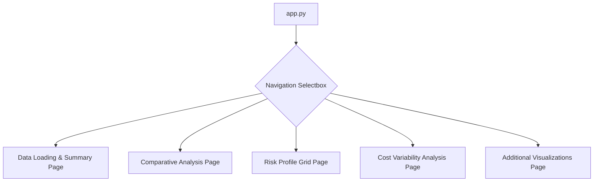

id: 68714c985887adf827c47d2f_documentation
summary: Risk Governance Lab 2 Documentation
feedback link: https://docs.google.com/forms/d/e/1FAIpQLSfWkOK-in_bMMoHSZfcIvAeO58PAH9wrDqcxnJABHaxiDqhSA/viewform?usp=sf_link
environments: Web
status: Published
# QuLab: Exploring Operational Risk Measurement

## Introduction
Duration: 05:00

Welcome to the QuLab Codelab! This interactive lab explores various operational risk measurement approaches and provides a hands-on guide to a Streamlit application built for this purpose. Understanding and effectively measuring operational risk is crucial for financial institutions and businesses across all sectors. Operational risk refers to the risk of loss resulting from inadequate or failed internal processes, people, and systems, or from external events. It's a broad category that can include anything from human error and fraud to system failures and legal risks.

This application, QuLab, serves as a practical tool to visualize and analyze key aspects of operational risk measurement. By working through this codelab, you will understand:

*   The importance of **data quality** as the foundation for any risk analysis.
*   How to perform **comparative analysis** to benchmark risk management performance.
*   Methods for visualizing **risk profiles** based on likelihood and severity.
*   Techniques for analyzing **cost variability** as an indicator of operational efficiency.
*   Additional methods for **visualizing data trends** over time and across categories.

The application is built using Streamlit, a Python library that allows you to create interactive web applications with pure Python code. It is structured into different pages, accessible via the sidebar, each focusing on a specific aspect of operational risk analysis.

Here's a high-level view of the application's structure:



Let's dive in and explore each section of the application.

## Step 1: Data Loading & Summary
Duration: 07:00

The first crucial step in any data analysis, especially in risk management, is loading and validating your data. Bad data leads to unreliable results and poor risk management decisions. This section of the application focuses on ensuring the data meets the basic requirements for the subsequent analyses.

<aside class="positive">
<b>Business Value:</b> High-quality, structured data is the absolute prerequisite for meaningful operational risk analysis. This step ensures your data is fit for purpose by checking for required columns, correct data types, and missing values. It directly supports the 'means of measurement' principle by emphasizing the need for reliable inputs.
</aside>

<aside class="negative">
<b>Warning:</b> Skipping proper data validation can lead to entirely misleading metrics and potentially costly risk management errors. Always start with data quality checks.
</aside>

The `application_pages/data_loading.py` script handles this functionality. It allows users to upload a CSV file or uses synthetic data if no file is uploaded. It then performs essential checks:

*   Checks for the presence of required columns: `Date`, `Cost per Trade`, `Trade ID`, `Risk Category`, `Severity`, `Likelihood`, `Firm Type`.
*   Attempts to convert columns to the correct data types (Date to datetime, others to numeric).
*   Warns about any missing values in critical fields.
*   Displays a summary of the loaded data using `.describe()` and the data types using `.dtypes`.

Here is the code for this page:

```python
import streamlit as st
import pandas as pd
import numpy as np

def run_data_loading():
    st.header("Data Upload, Validation, and Summary")
    st.markdown(r"""
**Business Value:**
The foundation of meaningful operational risk analysis is good-quality, structured data. Here, we load, validate, and summarize the trading data, which is used for all subsequent measurement and analytics. Ensuring correct columns, data types, and identifying potential data quality issues up front prevents spurious metrics and risk management decisions later.

**Technical Details:**
- Ensures all required columns are present: `Date`, `Cost per Trade`, `Trade ID`, `Risk Category`, `Severity`, `Likelihood`, `Firm Type`
- Checks data types, parses dates, and warns if any columns are missing or data types are incorrect.
- Summarizes data with `.describe()` and displays data types.

This step aligns directly with the 'means of measurement' principle bad data leads to unreliable measurement, regardless of approach.
""")

    def load_and_validate_data(uploaded_file=None):
        if uploaded_file is None:
            # Use synthetic data
            data = {
                'Date': ['2024-01-01', '2024-01-02', '2024-01-03', '2024-01-04', '2024-01-05'],
                'Cost per Trade': [10.5, 12.3, 11.0, 14.8, 9.7],
                'Trade ID': [101, 102, 103, 104, 105],
                'Risk Category': ['Market', 'Operational', 'Credit', 'Market', 'Operational'],
                'Severity': [5, 7, 4, 6, 8],
                'Likelihood': [6, 8, 3, 7, 9],
                'Firm Type': ['A', 'B', 'A', 'B', 'A']
            }
            df = pd.DataFrame(data)
            st.info("Using sample data. Upload a CSV file to use your own data.")
        else:
            try:
                df = pd.read_csv(uploaded_file)
            except Exception as e:
                st.error(f"Error loading file: {e}. Please ensure it's a valid CSV.")
                return None

        required_columns = ['Date', 'Cost per Trade', 'Trade ID', 'Risk Category', 'Severity', 'Likelihood', 'Firm Type']
        for col in required_columns:
            if col not in df.columns:
                st.error(f"Missing required column: `{col}`. Please ensure your CSV has all required columns.")
                return None

        try:
            df['Date'] = pd.to_datetime(df['Date'])
            df['Cost per Trade'] = pd.to_numeric(df['Cost per Trade'])
            df['Trade ID'] = pd.to_numeric(df['Trade ID'], downcast='integer')
            df['Severity'] = pd.to_numeric(df['Severity'], downcast='integer')
            df['Likelihood'] = pd.to_numeric(df['Likelihood'], downcast='integer')
        except Exception:
            st.error("Invalid data type in DataFrame. Please check 'Date', 'Cost per Trade', 'Trade ID', 'Severity', 'Likelihood' columns.")
            return None

        if df[required_columns].isnull().any().any():
            st.warning("Warning: Missing values detected in critical fields. Please review your data.")

        st.subheader("Data Description:")
        st.dataframe(df.describe())
        st.subheader("Data Types:")
        st.dataframe(df.dtypes.astype(str))
        st.success("Data loaded and validated successfully.")
        return df

    uploaded_file = st.file_uploader("Upload your CSV data", type=["csv"])
    df = load_and_validate_data(uploaded_file)
    st.session_state['risklab_df'] = df
    st.sidebar.markdown("")
```

**Interaction:**

Navigate to the "Data Loading & Summary" page using the sidebar.
You can either:
1.  Use the default sample data (if you don't upload anything). An info message will confirm this.
2.  Click the "Upload your CSV data" button and select a CSV file from your computer. Ensure your CSV has columns named exactly `Date`, `Cost per Trade`, `Trade ID`, `Risk Category`, `Severity`, `Likelihood`, and `Firm Type`.

After loading, the application will display the `describe()` output and the data types of the loaded DataFrame, along with success or error/warning messages based on the validation.

The loaded DataFrame is stored in Streamlit's `session_state` as `risklab_df`, making it available to other pages.

## Step 2: Comparative Analysis
Duration: 07:00

Benchmarking your firm's operational risk management capabilities against a peer or industry standard is a powerful way to identify strengths and weaknesses. This comparative analysis tool allows you to input scores across key quality areas and visualize the comparison.

<aside class="positive">
<b>Business Value:</b> Comparing your firm's performance metrics against benchmarks provides clear context and highlights areas needing improvement. This approach directly supports strategic decision-making by showing where your risk management efforts stand relative to peers or desired standards.
</aside>

The `application_pages/comparative_analysis.py` script facilitates this comparison:

*   It defines four key quality areas: Output, Process, Audience, and Success.
*   It provides number input fields for users to enter scores (0-100) for both their firm and the benchmark.
*   It generates a side-by-side bar chart comparing the scores for each quality area.

Here is the code for this page:

```python
import streamlit as st
import pandas as pd
import numpy as np
import matplotlib.pyplot as plt

def run_comparative_analysis():
    st.header("Comparative Analysis: Benchmarking Your Firm")
    st.markdown(r"""
**Business Value:**
Comparative analysis allows an organization to benchmark its operational risk management quality against a peer, standard, or industry average ("benchmark firm"). Decision makers can immediately visualize their strengths and areas for improvement in the four main quality areas:

- Output
- Process
- Audience
- Success

**Technical Details:**
- This function takes two sets of scores (firm scores and benchmark scores).
- It produces a side-by-side bar chart comparing scores by category.
- This approach closely mirrors market best practices and emphasizes **audience satisfaction** as the most actionable metric.
""")

    def perform_comparative_analysis(firm_scores, benchmark_scores):
        categories = list(firm_scores.keys())
        firm_values = list(firm_scores.values())
        benchmark_values = list(benchmark_scores.values())

        x = np.arange(len(categories))
        width = 0.35

        fig, ax = plt.subplots(figsize=(10, 6))
        ax.bar(x - width/2, firm_values, width, label='Firm', color='#1f77b4')
        ax.bar(x + width/2, benchmark_values, width, label='Benchmark', color='#ff7f0e')

        ax.set_xlabel('Quality Areas', fontsize=12)
        ax.set_ylabel('Scores', fontsize=12)
        ax.set_title('Comparative Analysis of Firm vs Benchmark', fontsize=14)
        ax.set_xticks(x)
        ax.set_xticklabels(categories, fontsize=12)
        ax.legend(fontsize=10)
        plt.tight_layout()
        return fig

    st.subheader("Enter Scores (0-100):")

    col1, col2 = st.columns(2)

    with col1:
        st.markdown("### Your Firm's Scores")
        firm_output = st.number_input("Output (Firm)", min_value=0, max_value=100, value=75, key='f_out', help="Score for the quality of outputs produced.")
        firm_process = st.number_input("Process (Firm)", min_value=0, max_value=100, value=80, key='f_proc', help="Score for the effectiveness of internal processes.")
        firm_audience = st.number_input("Audience (Firm)", min_value=0, max_value=100, value=90, key='f_aud', help="Score for audience satisfaction with risk management.")
        firm_success = st.number_input("Success (Firm)", min_value=0, max_value=100, value=70, key='f_succ', help="Score for overall success in achieving risk management goals.")
        firm_scores = {'Output': firm_output, 'Process': firm_process, 'Audience': firm_audience, 'Success': firm_success}

    with col2:
        st.markdown("### Benchmark Scores")
        bench_output = st.number_input("Output (Benchmark)", min_value=0, max_value=100, value=80, key='b_out', help="Score for benchmark's output quality.")
        bench_process = st.number_input("Process (Benchmark)", min_value=0, max_value=100, value=75, key='b_proc', help="Score for benchmark's process effectiveness.")
        bench_audience = st.number_input("Audience (Benchmark)", min_value=0, max_value=100, value=85, key='b_aud', help="Score for benchmark's audience satisfaction.")
        bench_success = st.number_input("Success (Benchmark)", min_value=0, max_value=100, value=75, key='b_succ', help="Score for benchmark's overall success.")
        benchmark_scores = {'Output': bench_output, 'Process': bench_process, 'Audience': bench_audience, 'Success': bench_success}

    st.pyplot(perform_comparative_analysis(firm_scores, benchmark_scores))
    st.markdown("")
```

**Interaction:**

1.  Navigate to the "Comparative Analysis" page.
2.  You will see two columns of number input fields: one for "Your Firm's Scores" and one for "Benchmark Scores".
3.  Enter scores between 0 and 100 for each of the four quality areas for both your firm and the benchmark.
4.  As you change the values, the bar chart below the input fields will automatically update, showing a visual comparison of the scores.

<aside class="positive">
<b>Key Takeaway:</b> The application highlights "Audience" satisfaction as particularly important because, it is often the most feasible and actionable metric to measure the effectiveness of risk management in practice.
</aside>

## Step 3: Risk Profile Grid
Duration: 06:00

A common tool in risk management is the risk matrix or risk profile grid, which plots risks based on their likelihood and severity. This visualization helps prioritize risks and categorize them based on their potential impact and frequency.

<aside class="positive">
<b>Business Value:</b> The risk profile grid provides an intuitive visual representation of operational risks, enabling stakeholders to quickly identify high-priority risks (high likelihood and high severity) and categorize others for appropriate management actions.
</aside>

The `application_pages/risk_profile.py` script allows you to visualize a single risk on a 10x10 grid:

*   Users input a risk name, a likelihood score (1-10), and a severity score (1-10).
*   The application plots this risk as a point on a grid.
*   The grid is divided into four quadrants, representing different risk categories: Ignore, Monitor, Cost, and Strategic Risk.

Here is the code for this page:

```python
import streamlit as st
import numpy as np
import matplotlib.pyplot as plt

def run_risk_profile():
    st.header("Interactive Risk Profile Grid")
    st.markdown(r"""
**Business Value:**
Visualizing risks in a grid, plotted by likelihood and severity, provides an intuitive way to categorize and prioritize operational risks. Stakeholders can easily see the most critical risks that require immediate attention. This is directly analogous to the 'Generic Risk Profiles' grid.

The risk profile is split into four sections:
- Ignore
- Monitor
- Cost
- Strategic Risk

**Technical Details:**
- The `plot_risk_profile` function takes severity, likelihood, and risk name as input.
- It plots a scatter plot of risks, with the axes representing likelihood and severity.
- Quadrants are marked to represent different risk categories (Ignore, Monitor, Cost, Strategic Risk), allowing for quick strategic categorization based on placement.
""")

    def plot_risk_profile(severity, likelihood, risk_name):
        fig, ax = plt.subplots(figsize=(8, 6))
        ax.scatter(likelihood, severity, marker='o', s=200, label=risk_name, color='#2ca02c', edgecolor='black', linewidth=1)

        ax.set_xlabel("Likelihood (1-10)", fontsize=12)
        ax.set_ylabel("Severity (1-10)", fontsize=12)
        ax.set_title("Risk Profile", fontsize=14)

        ax.set_xlim(0, 10)
        ax.set_ylim(0, 10)
        ax.set_xticks(np.arange(0, 11, 1))
        ax.set_yticks(np.arange(0, 11, 1))

        ax.axvline(x=5, color='black', linestyle='--', linewidth=0.8)
        ax.axhline(y=5, color='black', linestyle='--', linewidth=0.8)

        ax.text(2.5, 2.5, "Ignore", fontsize=14, ha='center', va='center', weight='bold', color='gray')
        ax.text(7.5, 2.5, "Monitor", fontsize=14, ha='center', va='center', weight='bold', color='#1f77b4')
        ax.text(2.5, 7.5, "Cost", fontsize=14, ha='center', va='center', weight='bold', color='#ff7f0e')
        ax.text(7.5, 7.5, "Strategic Risk", fontsize=14, ha='center', va='center', weight='bold', color='red')

        ax.legend(fontsize=10, loc='upper left')
        ax.grid(True, linestyle=':', alpha=0.7)
        plt.tight_layout()
        return fig

    st.subheader("Visualize a Risk:")
    risk_name_input = st.text_input("Risk Name", value="Data Breach", help="Enter a name for the risk to plot.")
    likelihood_input = st.slider("Likelihood (1=Low, 10=High)", min_value=1, max_value=10, value=8, help="Likelihood of the risk occurring.")
    severity_input = st.slider("Severity (1=Low, 10=High)", min_value=1, max_value=10, value=7, help="Severity of the impact if the risk occurs.")

    st.pyplot(plot_risk_profile(severity=severity_input, likelihood=likelihood_input, risk_name=risk_name_input))
    st.markdown("")
```

**Interaction:**

1.  Navigate to the "Risk Profile Grid" page.
2.  Enter a "Risk Name" (e.g., "System Outage").
3.  Use the sliders to select a "Likelihood" score (1-10) and a "Severity" score (1-10) for that risk.
4.  The plot will automatically update, placing the risk on the grid. Observe which quadrant the risk falls into (Ignore, Monitor, Cost, or Strategic Risk) to understand its potential implications.

## Step 4: Cost Variability Analysis
Duration: 08:00

Analyzing the variability of costs associated with processes, such as 'Cost per Trade', can provide insights into operational efficiency and potential risks related to cost overruns or unpredictable expenses. This section introduces the concept of Normalized Standard Deviation as a metric for this variability.

<aside class="positive">
<b>Business Value:</b> Monitoring cost variability helps identify processes that are inconsistent and potentially inefficient or prone to unexpected costs. Reducing variability can lead to more predictable expenses and improved operational control.
</aside>

The `application_pages/cost_variability.py` script calculates the Normalized Standard Deviation for a given set of cost data:

*   It allows using the 'Cost per Trade' data from the uploaded CSV (if available) or manually entering a list of cost values.
*   It calculates the standard deviation of the cost data.
*   It calculates the range (Max - Min) of the cost data.
*   It computes the Normalized Standard Deviation using the formula:
    $$ \text{Normalized Standard Deviation} = \frac{\sigma_{\text{cost per trade}}}{\text{Max Cost per Trade} - \text{Min Cost per Trade}} $$
*   A higher value indicates greater variability relative to the range of the data.

Here is the code for this page:

```python
import streamlit as st
import numpy as np
import pandas as pd # Import pandas to access st.session_state['risklab_df']

def run_cost_variability():
    st.header("Normalized Standard Deviation Calculator")
    st.markdown(r"""
**Business Value:**
The normalized standard deviation of cost per trade is a valuable metric for monitoring operational efficiency and identifying potential cost overruns. By understanding the variability in cost per trade, firms can better control expenses and improve overall profitability.

**Technical Details:**
- The `calculate_normalized_std_dev` function calculates the normalized standard deviation using the following formula:
""")
    st.latex(r"""
    \text{Normalized Standard Deviation} = \frac{\sigma_{\text{cost per trade}}}{\text{Max Cost per Trade} - \text{Min Cost per Trade}}
""")
    st.markdown(r"""
- Where $\sigma_{\text{cost per trade}}$ is the standard deviation of cost per trade. Normalization helps to compare variability across different scales of cost.
A higher normalized standard deviation indicates greater variability in cost per trade, which may warrant further investigation and process improvements.
""")

    def calculate_normalized_std_dev(cost_data):
        if not isinstance(cost_data, list):
            cost_data = list(cost_data)

        if not cost_data:
            raise ValueError("Cost data cannot be empty.")

        if len(cost_data) <= 1:
            return 0.0

        std_dev = np.std(cost_data)
        data_range = max(cost_data) - min(cost_data)

        if data_range == 0:
            return 0.0

        return std_dev / data_range

    st.subheader("Calculate Normalized Standard Deviation:")

    df = st.session_state.get('risklab_df', None)

    cost_data_to_use = []
    if df is not None and 'Cost per Trade' in df.columns and not df.empty:
        use_df_data = st.checkbox("Use 'Cost per Trade' from uploaded data", value=True)
        if use_df_data:
            cost_data_to_use = df['Cost per Trade'].tolist()
            st.write(f"Using {len(cost_data_to_use)} data points from 'Cost per Trade' column.")
        else:
            manual_cost_input = st.text_input("Enter comma-separated cost data (e.g., 10, 12, 15, 11, 13)", value="10, 12, 15, 11, 13", help="Enter numeric values separated by commas.")
            try:
                cost_data_to_use = [float(x.strip()) for x in manual_cost_input.split(',') if x.strip()]
            except ValueError:
                st.error("Invalid input. Please enter numeric values separated by commas.")
                cost_data_to_use = []
    else:
        st.info("No valid data loaded yet, please upload a CSV or use the sample data to enable analysis.")
        manual_cost_input = st.text_input("Enter comma-separated cost data (e.g., 10, 12, 15, 11, 13)", value="10, 12, 15, 11, 13", help="Enter numeric values separated by commas.")
        try:
            cost_data_to_use = [float(x.strip()) for x in manual_cost_input.split(',') if x.strip()]
            st.write(f"Using {len(cost_data_to_use)} manually entered data points.")
        except ValueError:
            st.error("Invalid input. Please enter numeric values separated by commas.")
            cost_data_to_use = []


    if cost_data_to_use:
        try:
            normalized_std_dev = calculate_normalized_std_dev(cost_data_to_use)
            st.metric(label="Normalized Standard Deviation", value=f"{normalized_std_dev:.4f}")
        except ValueError as e:
            st.error(e)
    else:
        st.warning("No cost data available for calculation.")
    st.markdown("")
```

**Interaction:**

1.  Navigate to the "Cost Variability Analysis" page.
2.  If you uploaded data in Step 1 with a 'Cost per Trade' column, you can choose to use that data via the checkbox (default). The application will display the number of data points used.
3.  Alternatively, uncheck the box and manually enter a comma-separated list of numeric cost values in the text input field.
4.  The application will calculate and display the "Normalized Standard Deviation" metric based on the data source you selected.

## Step 5: Additional Visualizations
Duration: 09:00

Beyond specific risk metrics, visualizing data trends over time and comparing aggregated metrics across different categories can reveal important patterns and insights into operational risk exposures and cost drivers. This section provides examples of such visualizations using the loaded data.

<aside class="positive">
<b>Business Value:</b> Trend analysis helps detect shifts in risk profiles or cost patterns over time, enabling proactive management. Categorical analysis helps pinpoint which business areas, risk types, or firm characteristics contribute most significantly to overall risk or cost variability.
</aside>

The `application_pages/additional_visualizations.py` script generates two interactive plots using Plotly:

1.  **Time-based Trend Plot:** Shows the evolution of 'Cost per Trade' over time using a line chart. This requires the 'Date' and 'Cost per Trade' columns.
2.  **Categorical Insights:** Shows the average 'Severity' for each 'Risk Category' using a bar chart. This requires the 'Risk Category' and 'Severity' columns.

These visualizations are only available if data has been successfully loaded in the "Data Loading & Summary" step.

Here is the code for this page:

```python
import streamlit as st
import pandas as pd
import plotly.express as px

def run_additional_visualizations():
    st.header("Time-based Trend Plot")
    st.markdown("""
**Business Value:**
Understanding the evolution of key metrics over time is crucial for identifying patterns, cycles, and anomalies in operational risk. This plot visualizes the trend of 'Cost per Trade' over time, allowing for the detection of increasing/decreasing costs or periods of higher volatility.

**Technical Details:**
- Utilizes the `Date` and `Cost per Trade` columns from the loaded data.
- Presents a line chart to show the temporal trend using Plotly.
""")

    df = st.session_state.get('risklab_df', None)

    if df is not None and not df.empty:
        # Time-based Trend Plot
        st.subheader("Cost per Trade Trend Over Time")
        try:
            df_sorted = df.sort_values(by='Date')
            fig_trend = px.line(df_sorted, x='Date', y='Cost per Trade',
                                title="Trend of Cost per Trade Over Time",
                                labels={"Date": "Date", "Cost per Trade": "Cost per Trade"})
            st.plotly_chart(fig_trend, use_container_width=True)
        except Exception as e:
            st.error(f"Error creating time-based trend plot: {e}")

        st.markdown("")

        st.header("Categorical Insights")
        st.markdown("""
**Business Value:**
Categorical analysis helps identify which segments (e.g., risk categories, firm types) exhibit higher or lower risk profiles or cost efficiencies. This visualization provides an aggregated comparison of 'Severity' by 'Risk Category', offering insights into inherent risks associated with different operational areas.

**Technical Details:**
- Groups the loaded data by 'Risk Category'.
- Calculates the average 'Severity' for each category.
- Presents a bar chart for easy comparison using Plotly.
""")

        st.subheader("Average Severity by Risk Category")
        try:
            avg_severity_by_category = df.groupby('Risk Category')['Severity'].mean().reset_index()
            fig_category = px.bar(avg_severity_by_category, x='Risk Category', y='Severity',
                                   title="Average Severity Across Risk Categories",
                                   labels={"Risk Category": "Risk Category", "Severity": "Average Severity"})
            st.plotly_chart(fig_category, use_container_width=True)
        except Exception as e:
            st.error(f"Error creating categorical insights plot: {e}")

        st.markdown("")
    else:
        st.info("Upload data to see the Additional Visualizations.")

    st.header("Summary and Next Steps")
    st.markdown("""
In this lab, you have:

- Explored three primary means of measuring operational risk management quality: Standard-Based, Comparative, and Predictive.
- Learned about the importance and challenges of data quality and validation for risk functions.
- Used visual tools to benchmark your organization's effectiveness, plot risk profiles, and monitor operational efficiency with normalized standard deviation.
- Understood, with practical examples, why **audience satisfaction** is often the most feasible and actionable metric.
- Connected operational risk metrics and grids to their strategic interpretations.

**Business Value Summary:**
These tools provide both immediate value—by helping you benchmark and prioritize risk areas—and longer-term value in building a measurement culture that aligns with both feasibility and best practices.
```

**Interaction:**

1.  Navigate to the "Additional Visualizations" page.
2.  If you successfully loaded data with the required columns in Step 1, the application will automatically display:
    *   A line chart showing the trend of 'Cost per Trade' over time.
    *   A bar chart showing the average 'Severity' grouped by 'Risk Category'.
3.  You can hover over the charts to see specific data points (Plotly feature).
4.  If no data was loaded, an info message will prompt you to upload data first.

## Step 6: Summary and Next Steps
Duration: 03:00

You have now explored the key functionalities of the QuLab application, gaining practical insights into operational risk measurement techniques.

<aside class="positive">
<b>Business Value Summary:</b> The tools and concepts demonstrated in this lab provide both immediate value—by helping you benchmark and prioritize risk areas—and longer-term value in building a measurement culture that aligns with both feasibility and best practices. Effective operational risk measurement supports better decision-making, improved efficiency, and ultimately, stronger business performance.
</aside>

In this lab, you have:

*   Explored different means of measuring operational risk management quality.
*   Understood the critical role of data quality and validation.
*   Used interactive tools for:
    *   Benchmarking performance (Comparative Analysis).
    *   Prioritizing individual risks (Risk Profile Grid).
    *   Analyzing process variability (Normalized Standard Deviation).
    *   Visualizing data trends and categorical comparisons.
*   Understood why metrics like "Audience Satisfaction" are often the most actionable.
*   Connected specific operational risk metrics and visualizations to strategic interpretations.

We encourage you to experiment further with the application, perhaps by preparing and uploading your own operational data (ensuring it matches the required column structure).


This concludes the QuLab Codelab. Thank you for participating!
